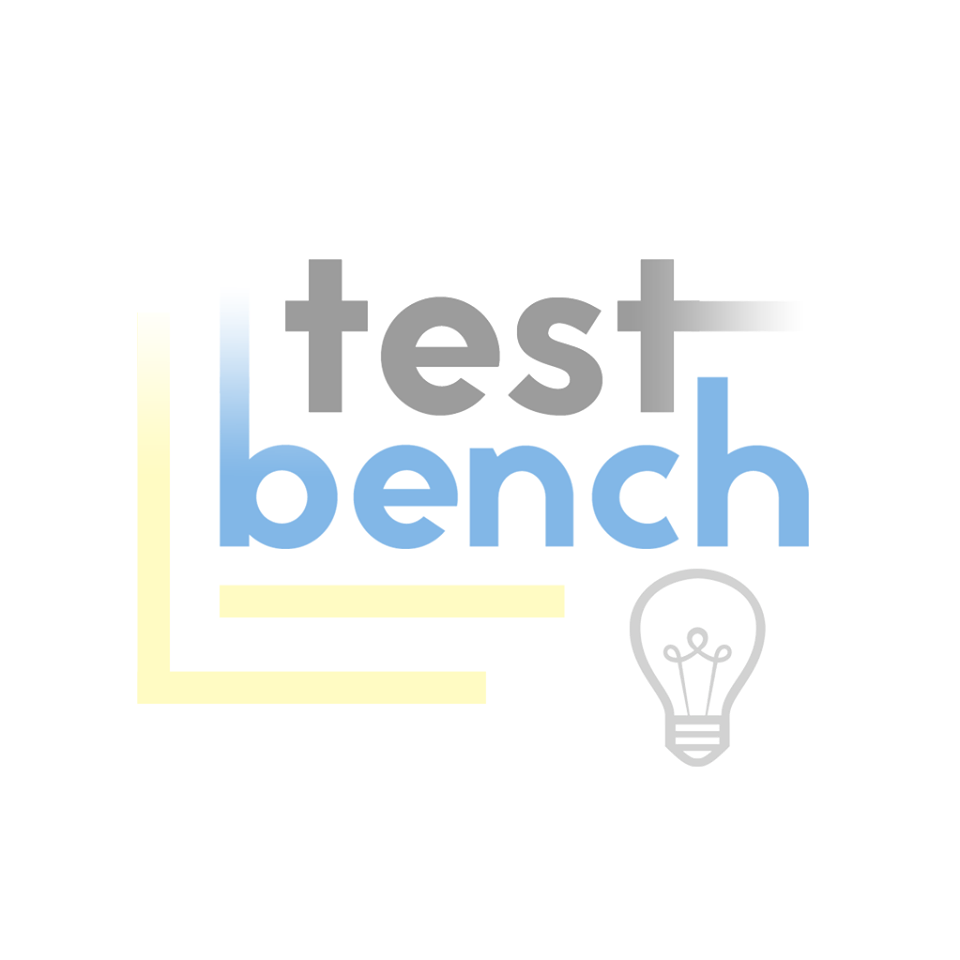
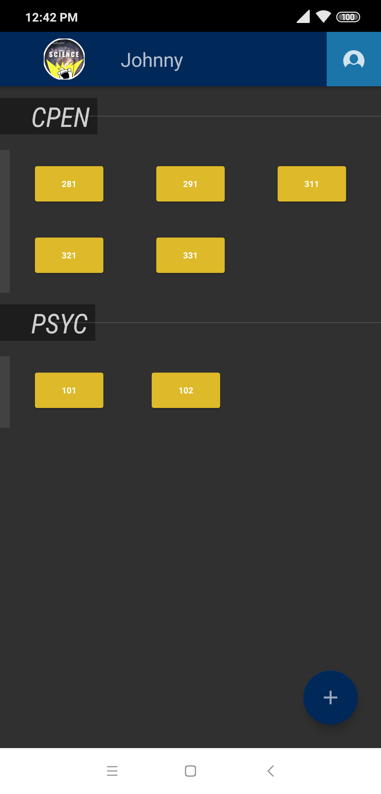
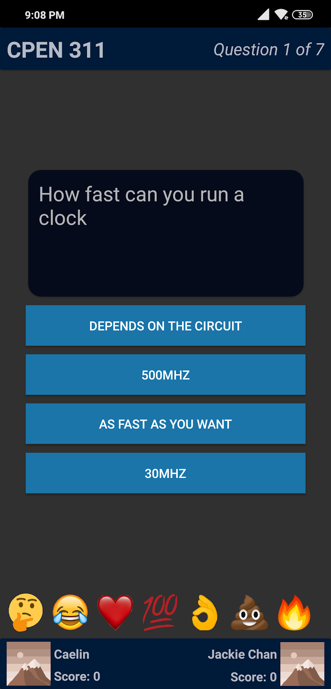
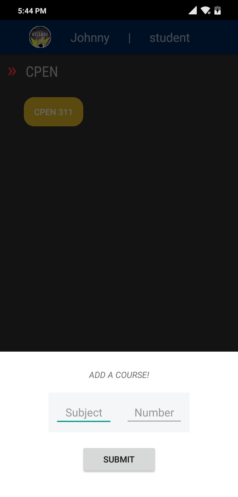

Testbench: CPEN 321 Project  
===  
  
  
Team Members:  
  * Johnny Ma  
  * Andrea Mah  
  * Caelin Preston  
  * Robin Reyes  
  
This is a shared repository for the team's group project for CPEN 321 at UBC. The project is supposed to implement a client server program with a native mobile application as the client.
  
#Main Features:  
 *Real time 1v1 quiz battles on UBC course material
 *User submitted and rated questions
 *User profiles with Facebook Integration
 *Player Statistic for each course
 *Live Emojis

[Powerpoint presentation](https://docs.google.com/presentation/d/16KwkZB6eJynKuqB1Zw6rj3CaH_yFGLVtBpa8pTn1Azw/edit?usp=sharing)
  
===
  
##Images  
  
  
Main Menu  
  

Gameplay  
  

Add Course

